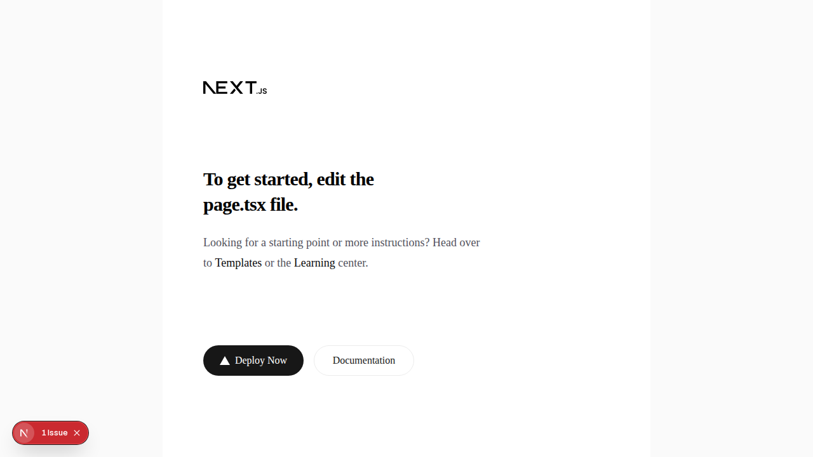
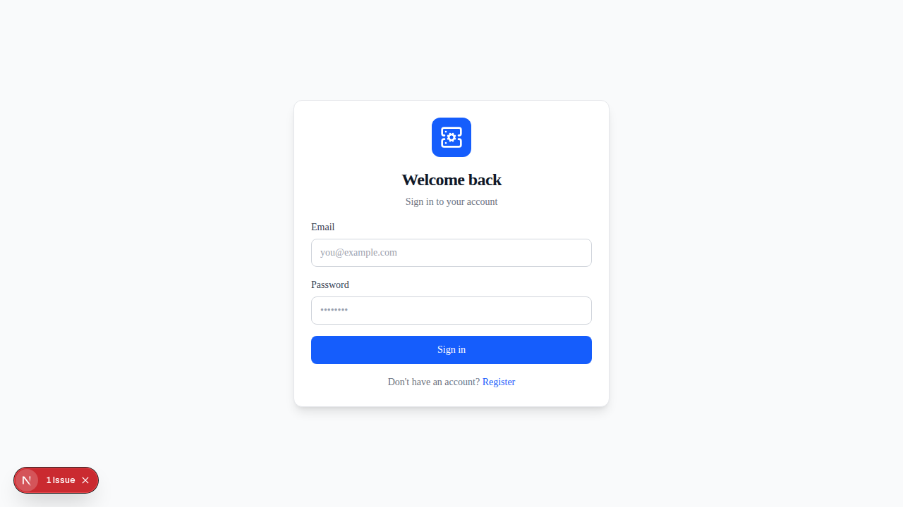
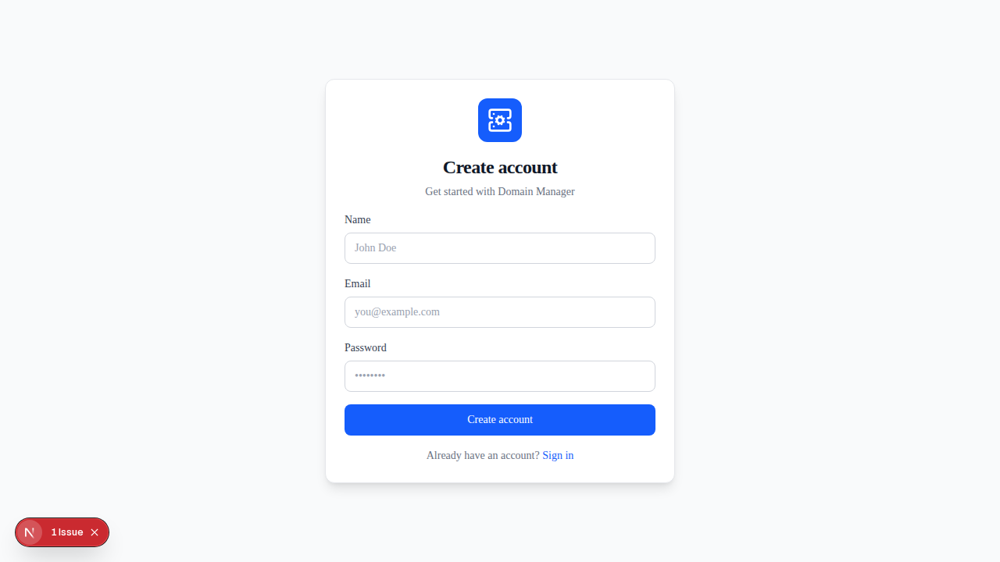
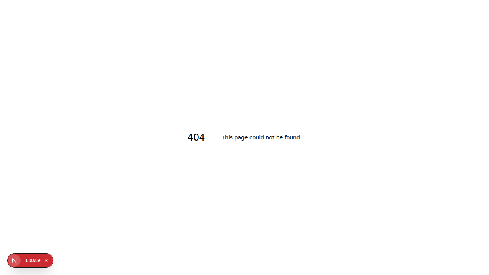
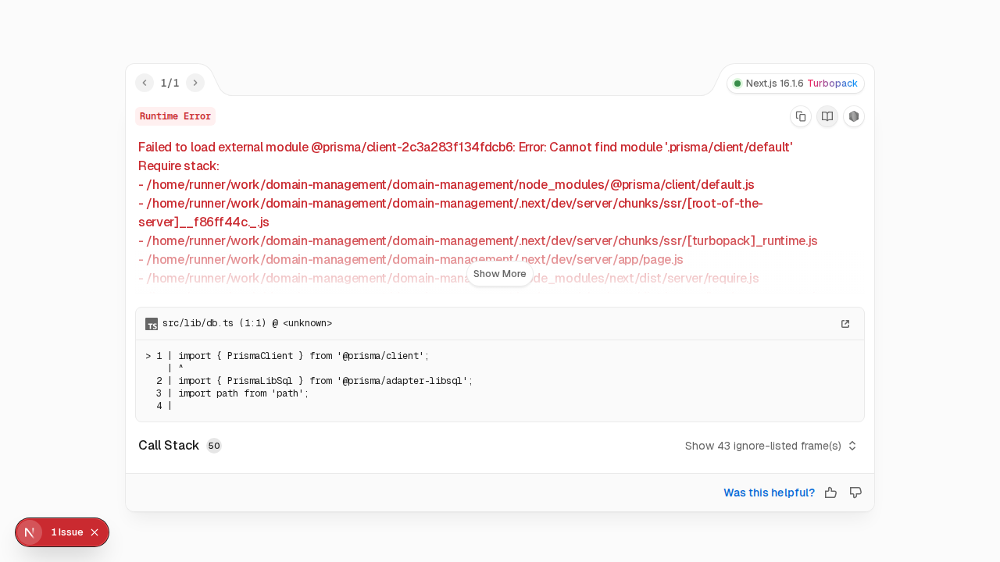

# Domain Management

Self-hosted domain management application with a clean, Ubiquiti-inspired interface.

## Features

- **Multi-Provider Support**: Cloudflare, GoDaddy, Namecheap, and more
- **DNS Management**: Full DNS record control with proxying options
- **SSL Certificates**: Automatic Let's Encrypt certificate issuance and renewal
- **DynDNS**: Built-in dynamic DNS for home servers
- **Reverse Proxy**: Configure proxy hosts for your services
- **Secure Credentials**: AES-256-GCM encrypted storage for API keys

## Quick Start

### Docker (Recommended)

```bash
docker-compose up -d
```

Access at http://localhost:8070

### Development

```bash
npm install
npx prisma migrate dev
npm run dev
```

## Environment Variables

```env
# Database
DATABASE_URL="file:./data/domain-management.db"

# NextAuth (generate with: openssl rand -base64 32)
NEXTAUTH_URL="http://localhost:3000"
NEXTAUTH_SECRET="your-secret-here"

# Encryption key for credentials (generate with: openssl rand -hex 32)
ENCRYPTION_KEY="64-character-hex-string"
```

## Supported Providers

| Provider | DNS | Registration | Status |
|----------|-----|--------------|--------|
| Cloudflare | ✅ | ❌ | Full Support |
| GoDaddy | ✅ | ❌ | DNS Only |
| Namecheap | 🔜 | 🔜 | Coming Soon |
| Crazy Domains | 🔜 | 🔜 | Coming Soon |

## Tech Stack

- **Framework**: Next.js 14 (App Router)
- **Database**: SQLite + Prisma
- **Auth**: NextAuth.js v5
- **Styling**: Tailwind CSS
- **Icons**: Lucide React

## Screenshots

### Home Page


### Login Page


### Register Page


### Dashboard


### Domains Management


### DNS Providers


### Add Provider


### SSL Certificates


### Reverse Proxy


### Settings


---

To generate updated screenshots:

```bash
npm run screenshots
```

Screenshots are saved to the `screenshots/` directory.
